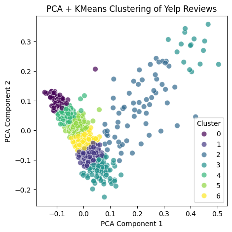

  

This is our input query:
`Food is great just wish it was bigger and you didnt have to call to make a reservation`

These are recommendations without clustering:
`works like a strip bar...... we were greeted to sit down on a table of five, after we ordered food we were rudely asked to switch tables, we didnt mind so we asked to be seated in a bigger table since our options were to move to a much smaller table.\n\nThe owner came over and was worse than his own staff, and demanded we move now since a big shot is coming...\n\nAgain we said we didnt mind we just needed a bigger table lol... The owner then aggressively told me this table was a mistake by our staff for you to sit here, this was one hour later of us sitting. He then snapped hookah from me and asked me and my group to get the f\*\*k out.\n\nSo we did politely without an issue, the arrogance of this place left a bad taste in my mouth.\n\nBasically if you dont know the owner, dont go! or else someone who knows the owner will be taken care of instead of you.\n\nGood Luck!`

`I have no idea about the food or service, as the restaurant was closed for lunch on the day I had a reservation for a party of 12. They had an accident in the kitchen regarding a fire suppressant system. I know accidents happen and they had tried to call me. The very nice hostess made a point of coming to the door and took my name and number so that the Manager could call me to apologize. Guess what, 2 weeks later - No Call! Where does a party of 12 drop in? It was a huge hassle and no call?? Do they not know about the longevity of restaurants on Market Street? Better step it up.`

`if i could give this hotel negative stars, i certainly would.\n\nthe short story is: twice now i have been charged $408 dollars (yes, total of $816) because of their incompetency, and they have done NOTHING to rectify the situation.\n\nlast year, i reserved two room there for ironman wisconsin. they have a policy to cancel room two weeks prior or more. fair enough. two months prior, i called them to cancel both rooms. they said everything was taken care of.\n\nfast forward to two weeks prior to ironman, i double check the online system to make sure the rooms are cancelled. they were not. i call the hotel again to cancel they said everything was taken care of. \n\ntwo days later, i triple check online. still not cancelled. i call the hotel yet again. the woman says she'll look into it and call me back. she never does. a $408 charge is posted to my account. i call again. the woman says again she will look into it \"but there's probably nothing i can do.\" i hear nothing from her again.\n\ntwo weeks later, weekend of ironman, i get a voicemail from a different woman, confirming my room reservations. i call her back, leave her a voicemail, clearly irritated at this point that the rooms were STILL not cancelled. she calls me back, leaves a voicemail. i call her back, leave her a voicemail, no return call.\n\nnow, today, a week after ironman, i get ANOTHER $408 charge posted to my account. this is completely unacceptable! how can you justify charging someone $816 for YOUR mistakes!?\n\nSTAY AWAY. on top of that, it's an outdated hotel... clearly their reservation system reflects that as well.`

These are recommendations with KMeans clustering (7 clusters):

`Great concept! \n\nDefinitely worth the try ! `

`Had the 1 meat plate [$10]  Brisket was fresh & amazing.  It was just thing I was craving.  My sides were the baked potato casserole & greens beans.  Friendly staff too!  Ended up getting kids sized cups for 1.50.\n\n[*] I let them know I had cold Brisket they were apologetic & told me they'd have fresh Brisket out for me.  Sure enough they did!  Came right out with a huge serving I took a photo of the nice portion. `

`Easy walk in on a Friday night at 5pm. I just moved here from CA and I was surprised at the price of $32. Maybe I am from the land of cheap pedicures at $20. This is the first nail salon that I have ever been to that only had 5 magazines and I couldn't even find them. They were hiding under the coffee table in the front of the shop. It was a nice quiet atmosphere. `
